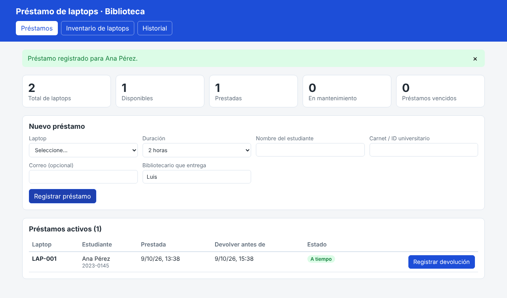

# Préstamo de laptops · Biblioteca universitaria

Aplicación web para llevar el registro de las laptops que la biblioteca presta a los estudiantes:
inventario, préstamos activos (con alerta de vencidos), devoluciones con observaciones e historial.



Hecha con **React + TypeScript + Vite**. Los datos se guardan en el navegador (localStorage).

## Cómo usarla

Requiere [Node.js](https://nodejs.org) 20 o superior.

```bash
npm install
npm run dev      # abre http://localhost:5173
npm run build    # genera la versión final en dist/
```

## Verla en línea

La app se publica sola en GitHub Pages cada vez que se actualiza la rama `main`:
https://michaelzzve-tech.github.io/crai/

Cada persona que la abre tiene sus propios datos, guardados en su navegador.

## Funciones

- **Inventario**: registrar laptops (código, marca, modelo, serie, notas), buscar, enviar a mantenimiento, eliminar.
- **Préstamos**: prestar una laptop disponible a un estudiante (nombre, carnet, correo, bibliotecario, duración).
- **Devoluciones**: registrar la devolución con observaciones (daños, faltantes).
- **Historial**: todos los préstamos, con búsqueda y marca de devoluciones con retraso.
- **Resumen**: totales de disponibles, prestadas, en mantenimiento y préstamos vencidos.

Reglas incluidas: no se repiten códigos de inventario, solo se prestan laptops disponibles,
un estudiante (carnet) no puede tener dos laptops a la vez, y no se elimina una laptop prestada.

## Estructura (por componentes)

```
src/
├── types/            Tipos de datos (Laptop, Prestamo…)
├── data/             Acceso a datos
│   ├── repository.ts             Interfaz `Repositorio`
│   ├── localStorageRepository.ts Implementación en el navegador
│   └── index.ts                  Aquí se elige qué implementación usar
├── services/
│   └── prestamoService.ts        Reglas del negocio (prestar, devolver, validar)
├── hooks/
│   └── useBiblioteca.ts          Carga y refresca los datos
├── utils/            Fechas e IDs
├── components/       Una carpeta por componente
│   ├── Encabezado/        Título y pestañas
│   ├── Resumen/           Tarjetas con totales
│   ├── EstadoBadge/       Etiqueta de color para estados
│   ├── LaptopForm/        Formulario de nueva laptop
│   ├── LaptopList/        Tabla de inventario
│   ├── PrestamoForm/      Formulario de nuevo préstamo
│   ├── PrestamosActivos/  Préstamos en curso y devolución
│   └── Historial/         Historial de préstamos
├── styles/global.css  Estilos y colores (variables al inicio)
└── App.tsx            Une los componentes
```

## Cambios comunes

| Quiero… | Archivo |
|---|---|
| Cambiar las duraciones de préstamo | `src/components/PrestamoForm/PrestamoForm.tsx` (`DURACIONES`) |
| Cambiar o agregar reglas | `src/services/prestamoService.ts` |
| Agregar un campo a la laptop o al préstamo | `src/types/index.ts` y el formulario correspondiente |
| Cambiar colores | variables al inicio de `src/styles/global.css` |
| Usar un servidor / base de datos | crear una clase que implemente `Repositorio` y usarla en `src/data/index.ts` |

> Importante: con localStorage los datos viven solo en ese navegador y esa computadora.
> Para que varios mostradores compartan la información hay que conectar un backend (ver la última fila).
